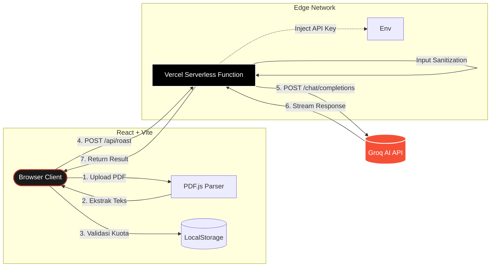

<div align="center">
  
# 🔥 CV Roaster
**Edisi Jujur Tanpa Filter — Powered by Groq AI**

[](https://reactjs.org/)
[](https://vitejs.dev/)
[](https://groq.com/)
[](https://vercel.com/)
[](https://opensource.org/licenses/MIT)

*Aplikasi web yang menerima upload CV dari mahasiswa dan memberikan feedback tajam ala HRD senior. Tidak ada pujian palsu, tidak ada basa-basi.*

[Mulai Roasting](#-cara-setup--development-lokal) • [Arsitektur](#-arsitektur-sistem) • [Deployment](#-panduan-deploy-ke-vercel)

</div>

---

## ✨ Fitur Utama

- 🧠 **AI Roasting Engine**: Didukung oleh model Groq `llama-3.3-70b-versatile` dengan *system prompt* khusus persona HRD Senior Galak Indonesia.
- 🎟️ **Sistem Voucher Multi-Tier**: Monetisasi cerdas dengan kuota berjenjang (Free, Starter, Pro, Unlimited) menggunakan algoritma validasi *client-side*.
- 🛡️ **Keamanan Kelas Enterprise**: Dilengkapi Rate Limiting, File Size Limiting, Input Sanitization, dan Vercel Edge Proxy untuk melindungi API Key.
- 📄 **Dual-Mode Parsing**: Mendukung ekstraksi teks langsung dari dokumen PDF (`pdfjs-dist`) atau input teks manual.
- 🎨 **Premium UI/UX**: Antarmuka bergaya *Dark Editorial* dengan *Glassmorphism*, transisi halus, dan animasi *scroll-triggered*.

---

## 🏗 Arsitektur Sistem

CV Roaster menggunakan arsitektur *Serverless Proxy* untuk memastikan keamanan API Key sekaligus memberikan performa maksimal tanpa backend server tradisional.



---

## 🛠 Tech Stack

| Kategori | Teknologi | Deskripsi |
|---|---|---|
| **Frontend** | React 18, Vite | Framework UI & Build tool super cepat |
| **Styling** | Vanilla CSS | Desain kustom dengan animasi keyframes tingkat lanjut |
| **Backend** | Vercel Serverless | Proxy API `req/res` handler (`api/roast.js`) |
| **AI Engine** | Groq API | Eksekusi Llama 3.3 dengan latensi ultra-rendah |
| **PDF Parser** | `pdfjs-dist` | Ekstraksi teks dokumen langsung di browser klien |

---

## 🔐 Standar Keamanan

Sistem telah diaudit untuk lingkungan produksi:
- ✅ **API Key Hiding**: `GROQ_API_KEY` disimpan di Vercel, *never exposed to browser*.
- ✅ **Server-side Rate Limiting**: Max 5 request / menit / IP via Edge Function.
- ✅ **Client-side Debounce**: Cooldown 12 detik antar request UI.
- ✅ **Input Protection**: Pembatasan upload PDF max 5MB dan panjang teks max 10.000 karakter.
- ✅ **Data Sanitization**: Format schema validation untuk `localStorage` session state.

---

## 🚀 Cara Setup & Development Lokal

### Prasyarat
- Node.js v18+
- Akun [Groq Console](https://console.groq.com/) untuk mendapatkan API Key gratis.

### Instalasi

1. **Clone Repository**
   ```bash
   git clone https://github.com/arill2/Roasting-AI.git
   cd Roasting-AI
   ```

2. **Install Dependencies**
   ```bash
   npm install
   ```

3. **Konfigurasi Environment**
   Buat file `.env` di root direktori project:
   ```env
   # API Key untuk development lokal
   VITE_GROQ_API_KEY=gsk_your_api_key_here
   
   # Konfigurasi Kode Voucher (pisahkan dengan koma)
   VITE_VOUCHERS_STARTER=STR-12345,STR-ABCDE
   VITE_VOUCHERS_PRO=PRO-99999,PRO-XYZ12
   VITE_VOUCHERS_UNLIMITED=UNL-BOSS0,UNL-ADMIN
   ```

4. **Jalankan Server**
   ```bash
   npm run dev
   ```
   *Aplikasi akan berjalan di `http://localhost:5173`*

---

## 🌐 Panduan Deploy ke Vercel

Untuk mengaktifkan fitur keamanan penuh (Serverless Proxy), aplikasi harus di-deploy ke Vercel.

1. Push repository ini ke GitHub.
2. Login ke [Vercel Dashboard](https://vercel.com/) dan buat **New Project**.
3. Import repository **Roasting-AI**.
4. Buka tab **Environment Variables** dan tambahkan:
   - `GROQ_API_KEY` : *API Key Groq Anda (Tanpa awalan VITE_)*
   - `VITE_VOUCHERS_STARTER` : *Daftar kode starter*
   - `VITE_VOUCHERS_PRO` : *Daftar kode pro*
   - `VITE_VOUCHERS_UNLIMITED` : *Daftar kode unlimited*
5. Klik **Deploy**.

*Vercel akan secara otomatis menggunakan `vercel.json` untuk merutekan traffic `/api/*` ke serverless function.*

---

<div align="center">
  <sub>Dibangun dengan dedikasi untuk membantu mahasiswa Indonesia mendapatkan realita dunia kerja sedini mungkin.</sub>
</div>